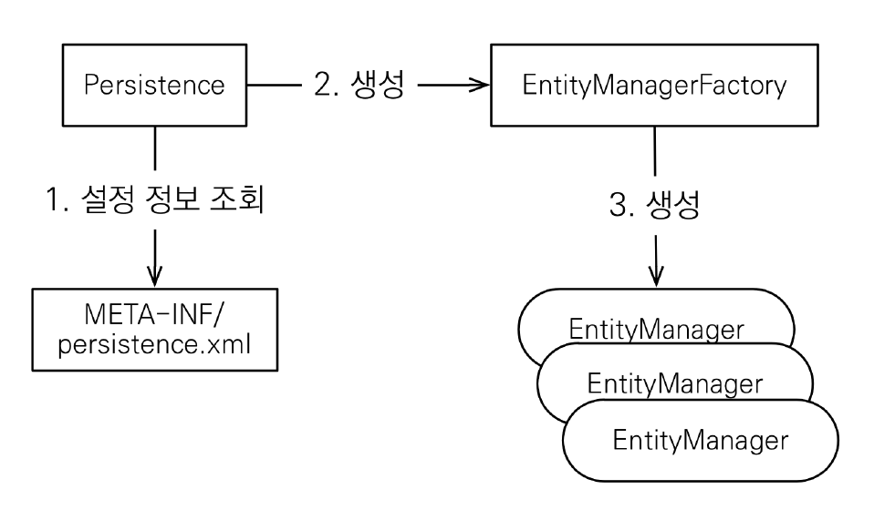

# JPA 시작하기

## 프로젝트 생성

Maven 프로젝트 생성 후 디펜던시에 JPA 하이버네이트와 H2 데이터베이스를 추가한다.

```xml
<dependencies>
    <!-- JPA 하이버네이트 -->
    <dependency>
        <groupId>org.hibernate</groupId>
        <artifactId>hibernate-entitymanager</artifactId>
        <version>5.3.10.Final</version>
    </dependency>
    <!-- H2 데이터베이스 -->
    <dependency>
        <groupId>com.h2database</groupId>
        <artifactId>h2</artifactId>
        <version>1.4.199</version>
    </dependency>
</dependencies>
```

## 데이터베이스 생성

데이터베이스는 docker를 이용해 간단하게 생성하자. docker를 생성하고 실행하면, `localhost:81/`로 접속 시, 웹 브라우저에서 DB를 관리할 수 있다.

```docker
docker run -d -p 1521:1521 -p 81:81 -v /path/to/local/data_dir:/opt/h2-data -e H2_OPTIONS='-ifNotExists' --name=h2 oscarfonts/h2
```

## JPA 설정 파일

JPA 설정 파일은 `resource/META-INF/persistence.xml`에 작성해야 한다. 

```xml
<?xml version="1.0" encoding="UTF-8"?>
<persistence version="2.2"
xmlns="http://xmlns.jcp.org/xml/ns/persistence" xmlns:xsi="http://www.w3.org/2001/XMLSchema-instance"
xsi:schemaLocation="http://xmlns.jcp.org/xml/ns/persistence http://xmlns.jcp.org/xml/ns/persistence/persistence_2_2.xsd">
<persistence-unit name="hello">
<properties>
<!-- 필수 속성 -->
<property name="javax.persistence.jdbc.driver" value="org.h2.Driver"/>
<property name="javax.persistence.jdbc.user" value="sa"/>
<property name="javax.persistence.jdbc.password" value=""/>
<property name="javax.persistence.jdbc.url" value="jdbc:h2:tcp://localhost/~/test"/>
<property name="hibernate.dialect" value="org.hibernate.dialect.H2Dialect"/>

<!-- 옵션 -->
<property name="hibernate.show_sql" value="true"/>
<property name="hibernate.format_sql" value="true"/>
<property name="hibernate.use_sql_comments" value="true"/>
<!--<property name="hibernate.hbm2ddl.auto" value="create" />-->
</properties>
</persistence-unit>
</persistence>
```

- `<persistence-unit name="hello">`로 설정파일에 대한 이름을 지정할 수 있다.
- `javax.persistence.*`로 시작하는 설정은 JPA에 대한 설정이다. JPA는 내부적으로 JDBC를 사용하고 있다.
- `hibernate.*`는 JPA의 구현체인 `hibernate`에 관한 내용이다.
- `hiberante.dialect`는 데이터베이스 방언을 `H2Dialect`로 지정한다는 의미이다. 같은 기능을 하더라도 DB에 따라 용어가 다를 수 있으므로, 용어가 다를 경우 `H2`에서 쓰는 방언을 사용하라는 의미이다.
- `hibernate.show_sql`은 실행되는 쿼리를 보여주는 옵션이다.
- `hibernate.format_sql`은 sql문을 이쁘게 출력해주는 옵션이다.
- `hibernate.use_sql_comments`은 sql문에 대한 코멘트(`/*Comment */`)를 보여준다. 
- `hibernate.hbm2ddl.auto`는 `Entity`에 맞는 테이블을 생성하는 DDL을 실행해주는 옵션이다.

## 엔티티 생성

`@Entity` 애노테이션을 붙어있는 VO 객체를 생성한다. 테이블과 정확히 1:1 매핑될 수 있도록 설계하는 것이 중요하다. 테이블과 이름이 다를 경우, `@Table` 애노테이션을 사용할 수 있고, 컬럼의 이름이 다를 경우 `@Column` 애노테이션을 사용할 수 있다.

```java
@Entity
//@Table(name="USER")
public class Member {
	@Id
	private Long id;
	
//	@Column(name = "username")
	private String name;
	
	public Long getId() {
		return id;
	}
	public void setId(Long id) {
		this.id = id;
	}
	public String getName() {
		return name;
	}
	public void setName(String name) {
		this.name = name;
	}
	
}
```

## JPA 코드 작성



1. Persistence는 `META-INF/persistence.xml` 설정파일을 토대로 `EntityManagerFactory`를 생성한다.

```java
public class JpaMain {
	
	public static void main(String[] args) {
           EntityManagerFactory emf = Persistence.createEntityManagerFactory("hello");
    }
}
```

<br>

2. 고객의 요청이 들어올 때마다 `EntityManagerFactory`에서 `EntityManager`를 생성한다. EntityManager는 `Connection`을 가지고 동작하게 된다.

```java
EntityManager em = emf.createEntityManager();
```

<br>

3. 고객의 요청을 트랜잭션 단위로 처리해야 하기 때문에 `EntityManager`로부터 `transaction`을 가져온다.

```java
EntityTransaction transaction = em.getTransaction();
```

<br>

4. 트랜잭션의 시작(`begin`)을 알린 후, JPA 코드를 작성한다. 트랜잭션이 끝나면, 커밋을 호출해 DB에 쿼리문을 전송한다.

```java
transaction.begin();
try {
    Member member = new Member();
    member.setId(2L);
    member.setName("helloB");

    //데이터 저장
    em.persist(member);

    //데이터 조회 
    Member findMember = em.find(Member.class, 1L);

    //데이터 수정
    findMember.setName("hello JPA");

    //DB에 반영.
    transaction.commit();
}
```

<br>

5. 트랜잭션이 실패했을 때, `rollback()`을 수행해야 하며, 트랜잭션이 성공하든 실패하든 `EntityManager`를 닫아줘야 한다. `EntityManager`는 쓰레드간에 공유하는 객체가 아니므로 반드시 사용 후 반환해야 한다.

```java
catch(Exception e){
    transaction.rollback();
} finally{
    em.close();
}

emf.close();
```

<br>

## JPQL

복잡한 조회를 해야 하는 경우, `JPQL`을 사용할 수 있다. `JPQL`은 `객체 지향 쿼리` 언어를 지원한다. 즉, `JPQL`은 테이블을 대상으로 하는 쿼리문이 아닌 `엔티티를 대상`으로 쿼리를 작성할 수 있다. 

```java
try {
    //JPQL Member Entity 5번부터 8개의 데이터를 가져와!
    List<Member> resultList = em.createQuery("select m from Member as m", Member.class)
    .setFirstResult(5)
    .setMaxResults(8)
    .getResultList();
    
    for(Member member : resultList) {
        System.out.println(member.getName());
    }
    
    transaction.commit();
}
```

데이터베이스 방언에 따라 paging 하는 방식이 다른데, JPQL을 사용할 경우 간편하게 paging이 가능하다!

