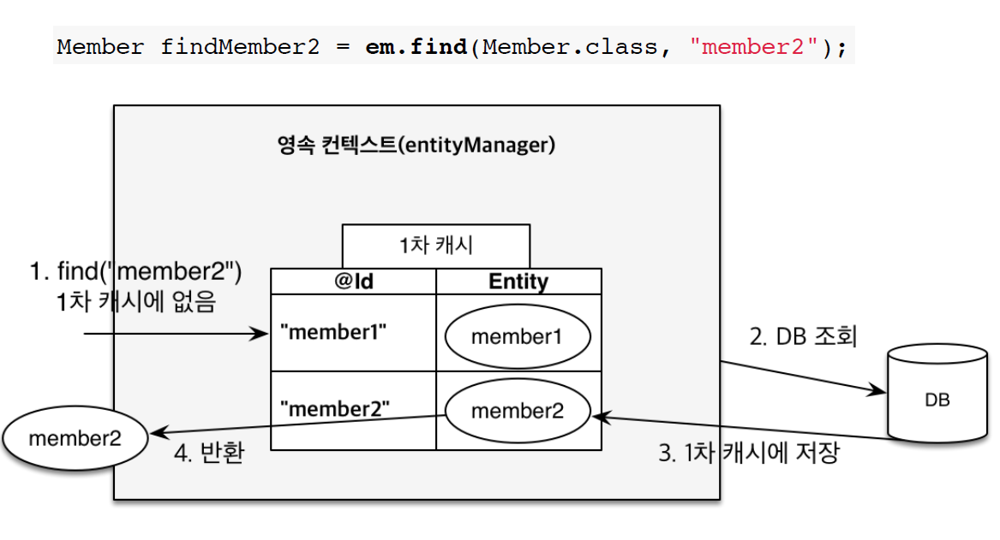
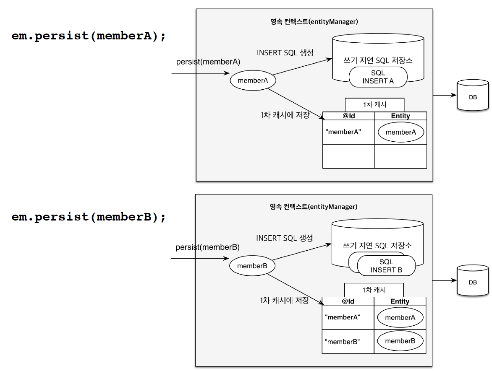
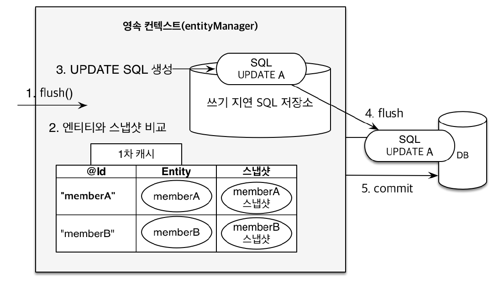

# 영속성 관리

## 영속성 컨텍스트

- 영속성 컨텍스트란 `엔티티를 저장하는 환경` 정도로 해석할 수 있다.
- 영속성 컨텍스트는 눈에 보이지 않는 `논리적 개념`이다.
- 영속성 컨텍스트에 접근하기 위해서는 `EntityManager`를 통해서 접근해야 한다.
- J2SE 환경에서는 `EntityManager`와 `PersistenceContext`가 1:1 매핑이지만 J2EE, Spring Framework 환경에서는 N:1 매핑이 된다.

## 엔티티 생명 주기

- 비영속(new/transient) : 영속성 컨텍스트와 관련이 없는 새로운 상태

```java
//객체를 생성한 상태 (비영속)
Member member = new Member();
member.setId("1L");
member.setName("길동");
```

<br>


- 영속(managed) : 영속성 컨텍스트에 의해 관리되는 상태

```java
Member member = new Member();
member.setId("member1");
member.setUsername(“회원1”);
EntityManager em = emf.createEntityManager();
em.getTransaction().begin();
//객체를 저장한 상태(영속)
em.persist(member);
```

<br>

- 준영속(detach) : 영속성 컨텍스트에 저장되었다가 분리된 상태

```java
em.detach(member);
```

<br>

- 삭제(remove) : 객체를 삭제한 상태

```java
em.remove(member);
```

<br><hr>

## 영속성 컨텍스트의 이점

### 1차 캐시



영속성 컨텍스트에 의해 관리된다는 말은 1차 캐시에 저장되어 있다는 말과 동일하다. `em.persist(member)`를 호출하면 member라는 객체는 1차 캐시에 `@Id`와 `Entity`로 저장된다.

`em.persist`뿐 아니라, `em.find(Member.class, memberId)`와 같이 조회를 하는 경우에도 위의 그림처럼 1차 캐시에서 `Entity`를 찾아보고, 1차 캐시에 없는 경우에는 DB에 조회한 후 결과를 1차 캐시에 집어넣는다.

1차 캐시는 동일한 조회에 대해서는 같은 결과를 반환하도록 되어있기 때문에 SQL 성능이 향상될 거라는 짐작을 할 수 있지만, 1차 캐시의 단위는 `transaction`이므로 성능 향상을 크게 기대하기는 어렵다.

### 동일성 보장

동일한 값을 두 번 조회하는 경우, 1차 캐시를 사용하기 때문에 동일한 객체를 돌려받게 된다. 이러한 컨셉은 Java의 Collection과 유사하다는 장점이 있다.

```java
Member a = em.find(Member.class, "member1");
Member b = em.find(Member.class, "member1");
System.out.println(a == b); //동일성 비교 true
```

### 쓰기 지연



`EntityManager`와 `DB` 사이에 `영속성 컨텍스트`가 반드시 필요한 요소는 아니다. 하지만 두 개체 사이에 중간 매개체가 존재하면 얻을 수 있는 공통 이점이 있는데, 그것이 `캐시`와 `버퍼링`이다. 쓰기지연은 `버퍼링`에 해당한다.

그림에서처럼 `persist(memberA)`가 호출되면 1차 캐시에 `memberA`를 넣고, 쓰기지연 SQL 저장소에 `INSERT` SQL문을 작성해둔다. `persist(memberB)`가 호출되면 마찬가지로 1차 캐시에 `memberB`를 넣고 쓰기 지연 SQL 저장소에 `INSERT`문을 작성해서 저장해 둔다.

`flush()`가 호출되면 1차 캐시에서 변경된 객체에 대한 `UPDATE` 쿼리를 쓰기 지연 SQL 저장소에 저장한 후, 모든 쿼리를 한 번에 실행한다. 이렇게 하는 경우, 커넥션을 얻고 반환하는 작업을 줄일 수 있기 때문에 효과적이라고 할 수 있다. 이 방식은 JDBC의 Batch 기능과 동일하다.

```java
EntityManager em = emf.createEntityManager();
EntityTransaction transaction = em.getTransaction();
transaction.begin();
try{
    em.persist(memberA);
    em.persist(memberB);
    //memberA, memberB의 INSERT문을 한 번에 전달한다.
    transaction.commit(); //commit 호출 시 flush가 호출 되도록 설정되어있다.(default)
} catch(Exception e){
    ...
}
```

### 엔티티 변경 감지



위에서 잠깐 언급했듯이, `flush()`가 호출되면 1차 캐시에서 변경된 객체를 감지해서 `UPDATE` 쿼리문을 작성한다. 이때 사용하는 `변경 감지` 기능은 `스냅샷`을 이용한다.

1차 캐시에 들어온 엔티티들이 어떤 상태인지 `스냅샷`을 남겨두고, `flush()`가 호출되었을 때, 모든 Entity에 대해서 스냅샷과 일치하는지 검사한다. 스냅샷과 일치하지 않는 경우에는 `Update` 쿼리를 작성해서 쓰기 지연 SQL 저장소에 저장한다.

```java
Member member = new Member();
member.setId(3L);
member.setName("길동");

//1차 캐시에 저장. INSERT 쿼리 작성
em.persist(member);

//1차 캐시에 저장된 스냅샷과 다른 객체 정보로 변환.
member.setName("홍길동");

//변경 감지를 통해 UPDATE 쿼리 작성.
transaction.commit();
```

<br><hr>

## flush

flush는 1차 캐시의 `변경 감지`를 통해 생성된 `Update` 쿼리를 쓰기 지연 SQL 저장소에 저장한 후, 모든 쿼리를 DB에 전달한다.

flush의 방법은 `em.flush()`, `transaction.commit()`, `JPQL 실행` 세 가지 방법이 있다.

`JPQL`을 실행하면 flush()가 일어나는 이유는 `동기화`문제 때문이다. 다음의 예제를 보자.

```java
em.persist(memberA);
em.persist(memberB);
em.persist(memberC);

query = em.createQuery("select m from Member m", Member.class);
List<Member> members= query.getResultList();
```

`members`에는 `memberA`, `memberB`, `memberC`가 조회가 되어야할까 말아야 할까? 

상황에 따라 다르지만, 일반적으로는 조회가 되는 상황이 많을 것 같다. 따라서 JPQL을 실행하기 전에 자동으로 flush()가 호출되도록 default로 설정되어있다.

### 플러시 옵션

`em.setFlushMode(FlushModeType.COMMIT)`으로 옵션을 수정할 수 있지만, 가급적이면 `FlushModeType.AUTO`로 설정되어있는 그대로 사용하는 것이 좋다. 이 옵션은 `커밋`이나 `쿼리` 실행 시 `flush`를 하는 옵션이다.

우리가 JPA를 사용하면서 `1차 캐시`와 `데이터베이스`의 동기화를 크게 신경쓰지 않아도 되는 이유는 JPA의 모든 작업이 `Transaction`으로 이루어지기 때문이다. 따라서 개발자는 `transaction`, `PersistenceContext` 이 둘의 시작과 끝을 맞춰주고, 마지막에 `동기화(commit)`를 진행하면 된다.

