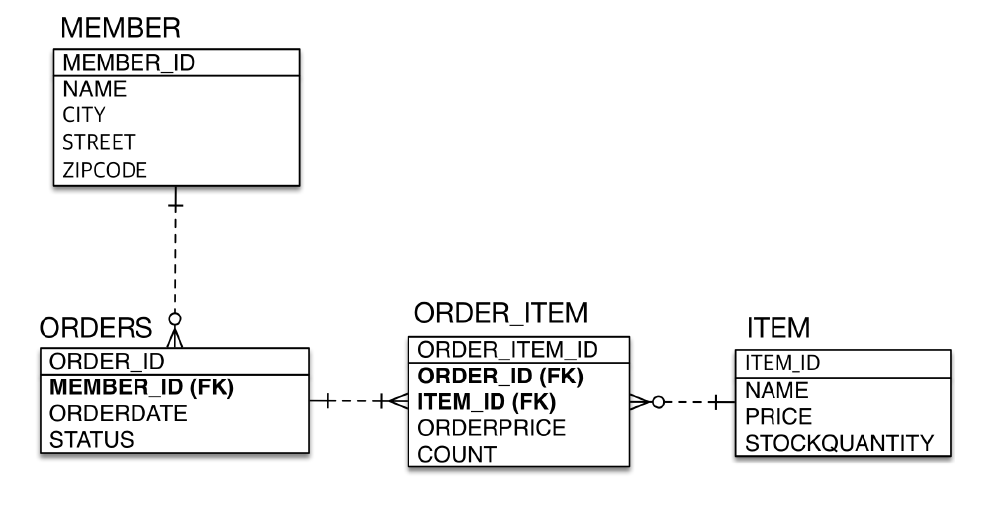

# 엔티티 매핑

## @Entity

`@Entity`가 붙은 클래스는 JPA가 관리하는 엔티티가 된다. 이 클래스는 데이터베이스의 테이블과 매핑된다.

## @Table

`@Table`은 엔티티와 매핑할 테이블을 지정할 수 있다.

- name : 매핑할 테이블 이름 (생략 가능)
- catalog : 데이터베이스 카탈로그 매핑
- schema : 데이터베이스 schema 매핑
- uniqueConstraints : DDL 생성 시에 유니크 제약조건 생성

```java
@Table(uniqueConstraints = {@UniqueConstraint( name = "NAME_AGE_UNIQUE",
columnNames = {"NAME", "AGE"} )})
```

## hibernate.bhm2ddl.auto

`hibernate.bhm2ddl.auto` 속성을 지정하면 `@Entity`로 지정된 엔티티들을 테이블로 생성 및 삭제할 수 있다.

- create : 기존 테이블 삭제 후 생성
- create-drop : create와 같으나 종료 시점에 테이블 삭제
- update : 새로 생긴 제약조건이나 컬럼들을 반영한다. 컬럼이 삭제되는 경우에는 반영되지 않음.
- validate : 엔티티와 테이블이 정상 매핑이 되었는지만 확인한다.
- None : 사용하지 않음.

### 운영 서버에서는 반드시 validate나 None을 사용한다.

운영 서버에서 update 사용 시, 테이블 전체에 Lock이 걸려, 서버가 몇 분간 멈출 수 있기 때문에 권장되지 않음.

다른 개발자와 함께 사용하는 테스트 서버에서도 가급적이면 create, update는 사용하지 말자. update 쿼리문을 직접 작성해서 테스트 서버에 반영해본 후, 운영 서버에 반영해보는 것이 Best !

<br><hr>

## 필드와 컬럼 매핑

### @Column

테이블의 컬럼에 매핑할 때 사용한다. 여러가지 속성으로 길이, Null, Unique 등을 조절할 수 있다.

- `name` : 필드와 매핑할 테이블의 컬럼 이름
- `insertable`, updatable : 삽입과 변경이 가능한 지에 대한 여부
- `nullable` : `false`로 지정하면 `NOT NULL`이 DDL에 추가된다.
- `unique` : 필드에 유니크 제약조건을 걸지만, 제약조건 이름이 이상하므로 가급적 사용하지 않음. `@Table`을 사용하자.
- `columnDefinition` : 데이터베이스의 컬럼 정보를 직접 작성할 수 있다. ex) `varchar(255) default 'EMPTY'`
- `length` : 문자 길이 제약조건, `String` 타입에서만 사용한다.
- `precision`, `scale` : `precision`은 소수점을 포함한 전체 자릿수, `scale`은 소수의 자릿수를 나타낸다. 큰 숫자와 정밀한 소수를 다루어야할 때 사용한다.

````java


### @Enumerated

enum 타입을 매핑할 때 사용한다.

- `value` : `EnumType.ORDINAL`, `EnumType.STRTNG` 두 가지 방법이 있는데, `ORDINAL`을 사용하면 데이터베이스에 enum의 순서를 저장하게 되고, `STRING`을 사용하게 되면 enum 이름을 사용하게 된다. 반드시 `STRING`을 사용하도록 하자.

```java
@Enumerated(EnumType.STRING)
private RoleType roleType;
````

### @Temporal

날짜 타입(`java.util.Date`, `java.util.Calendar`)을 매핑할 때 사용한다. 최신 하이버네이트 버전은 `LocalDate`, `LocalDateTime`을 지원한다.

- `TemporalType.Date` : 데이터베이스의 date 타입과 매핑 `(2020-2-1)`
- `TemporalType.TIME` : 시간, 데이터베이스 time 타입과 매핑 `(11:11:11)`
- `TemporalType.TIMESTAMP` : 날짜와 시간, 데이터베이스의 timestamp 타입과 매핑 `(2020-2-1 11:11:11)`

```java
@Temporal(TemporalType.TIMESTAMP)
private Date createdDate;
@Temporal(TemporalType.TIMESTAMP)
private Date lastModifiedDate;
```

```java
private LocalDateTime createDate;
private LocalDateTime lastModifiedDate;
```

### @LOB

데이터베이스의 BLOB, CLOB에 매핑된다. 문자열 타입이면 CLOB, 그 외에는 BLOB에 매핑된다.

```java
@LOB
private String description;
```

### @Transient

이 애노테이션이 붙은 필드는 테이블에 매핑되지 않는다. 임시로 어떤 값을 보관하고 싶을 때 사용.

```java
@Transient
private Integer temp;
```

<br><hr>

## 기본 키 매핑

기본 키 매핑 방법은 `직접 할당` 방법과 `자동 생성` 방법이 있다. `자동 생성` 방법에 대해 더 알아보자.

### Identity 전략

`Identity` 전략은 MySQL의 `AUTO_INCREMENT`와 같이 DB에서 자체적으로 지원해주는 `자동 생성` 방식을 따른다. 이 방식을 사용하면 JPA의 `INSERT` 쿼리에 id 값이 NULL로 셋팅되어있다.

주로 `MySQL`, `PostgreSQL`, `SQL Server`, `DB2`에서 사용한다.

**사용 예시**

```java
public class Member {

	@Id @GeneratedValue(strategy = GenerationType.IDENTITY)
	private Long id;
}
```

**발생하는 쿼리**

```sql
insert into Member(id, age, createdDate, description, lastModifiedDate, name, roleType)
values (null, ?, ?, ?, ?, ?, ?);
```

<br>

#### 단점

id 값이 null이라는게 조금 이상하다. 앞서 영속성 컨텍스트의 1차캐시는 {`@Id`, `@Entity`, `@Snapshot`} 형태로 이루어져 있다고 했다. 그런데, 쿼리를 전달하기 전에는 id를 모르니 1차 캐시에 데이터를 저장해두고 있을 수가 없다.

따라서 `Identity` 전략을 사용하게 되면, 쓰기 지연 기능을 사용하지 못한다. 영속성 컨텍스트로 관리하기 위해 `em.persist(member)`를 호출하면, 그 즉시 쿼리를 DB에 전송하고 DB로부터 `@id`를 받아와 영속성 컨텍스트에 집어 넣는다. DB 성능에 크게 영향을 미치지는 않지만, `Identity` 전략의 단점이라고 볼 수 있다.

### Sequence 전략

데이터베이스에는 유일한 값을 순서대로 생성하는 `Sequence`라는 오브젝트가 있다. 이 기능을 활용하여 id 식별자의 값을 할당하는 방법이다.

주로 `Oracle`, `PostgreSQL`, `DB2`, `H2` 데이터베이스에서 사용한다.

**사용 예시**

```java
@Entity
@SequenceGenerator(
name = "MEMBER_SEQ_GENERATOR",
sequenceName = "MEMBER_SEQ", //매핑할 데이터베이스 시퀀스 이름
initialValue = 1, allocationSize = 1)
public class Member {
    @Id
    @GeneratedValue(strategy = GenerationType.SEQUENCE,
    generator = "MEMBER_SEQ_GENERATOR")
    private Long id;
```

다소 복잡하게 느껴질 수 있는데, `@SequenceGenerator()`를 이용해서 `MEMBER_SEQ_GENERATOR`라는 Sequence Generator를 생성한 후, 그 generator를 이용해서 시퀀스를 생성하는 방법이다.

<br>

#### 단점

이 방법에도 약간 문제가 있다. `MEMBER_SEQ`는 데이터베이스에서 관리하는 객체라는 점이다. 즉, DB에 접근해서 시퀀스 값을 읽어오지 않는 한 id값을 알 수 없다는 점이 `Identity` 전략과 동일하다. 약간의 차이가 있다면, `Identity` 전략은 객체를 `영속` 하려는 즉시 쿼리를 실행하지만, `Sequence` 전략은 쿼리를 실행하지 않고 `MEMBER_SEQ`로부터 식별자 값만을 얻어온다. DB의 트래픽이 많아지므로 약간의 성능저하를 생각해볼 수 있다.

#### 보완

이러한 문제점을 극복하기 위해 `@SequenceGenerator()`에는 `initalValue`와 `allocationSize`라는 속성이 있다. `initalValue`는 단순히 처음 시작하는 시퀀스 번호를 결정하는 것이고, `allocationSize`가 중요하다.

`allocationSize`는 50으로 설정되어있는데, 시퀀스에 접근할 때마다 50개의 여유번호를 할당받는다고 보면 된다. 만약, `1`이라는 시퀀스를 할당받으면, 메모리 내에 `1~50` 까지의 번호를 저장해두었다가 활용하는 방식이다. 아래 코드로 예를 들어보자.

```java
//initalValue : 1, allocation : 50
em.persist(new Member()); //시퀀스 읽어옴 : 1 (메모리에 1~50까지 할당)
em.persist(new Member()); // 메모리에서 읽어와 id값 2로 할당
em.persist(new Member()); // 메모리에서 읽어와 id값 3으로 할당
```

멀티 쓰레드 환경에서 `allocationSize`가 잘 동작할까? 다행이도 잘 동작한다. 그 이유는 여러 서버에서 DB의 시퀀스를 읽어와도 자신만의 시퀀스 공간 `(1~50)` `(51~100)`, `(101~150)` 을 할당받아 사용하기 때문이다. 하지만 `allocationSize`가 클 경우, 시퀀스 번호 사이사이에 구멍이 크게 생길 수도 있다.

<br><hr>

## 데이터 중심의 설계



이 테이블을 객체로 그대로 나타낼 경우, 객체 그래프탐색을 못하게 된다.

데이터 중점으로 설계된 `Order` 엔티티에서 `Member`를 조회한다고 가정해보자.

```java
Order order = em.find(Order.class, orderId);
Long memberId = order.getMemberId();
Member member = em.find(Member.class, memberId);
```

객체지향스럽지 못하다. 만약 `Order` 객체가 `Member` 객체를 포함하고 있다면 어땠을까?

```java
Member member = em.find(Order.class, OrderId).getMember();
```

이렇게 한 줄로 표현할 수 있었을 것이다. 다음 챕터에서는 이런 연관 관계 매핑에 대해서 알아보자.
