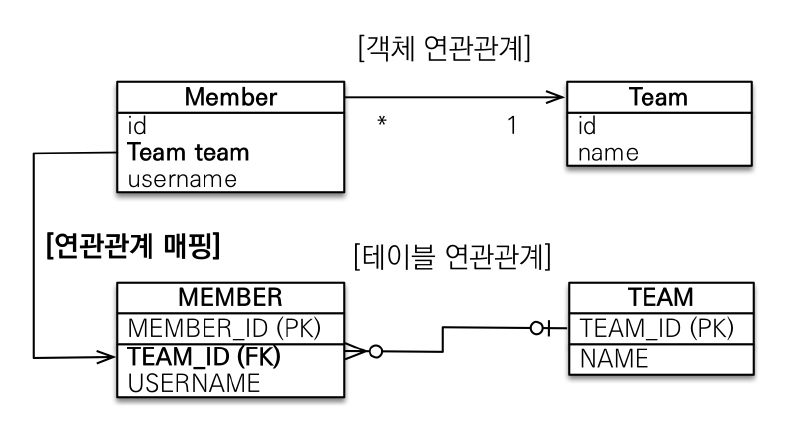
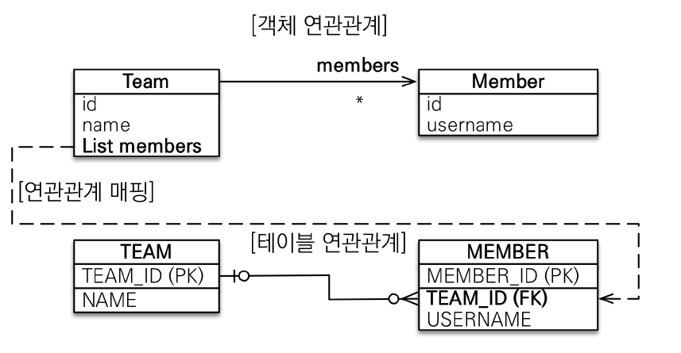
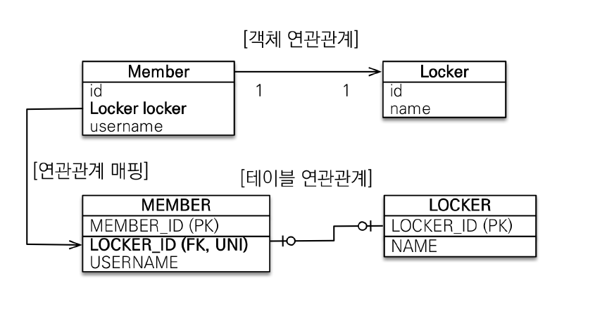
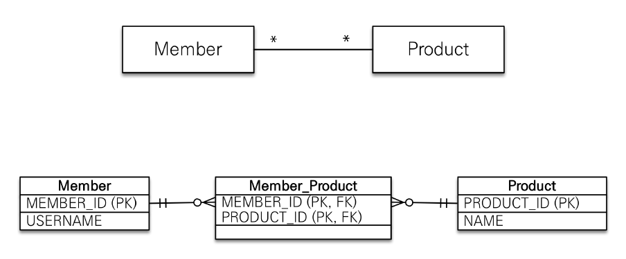
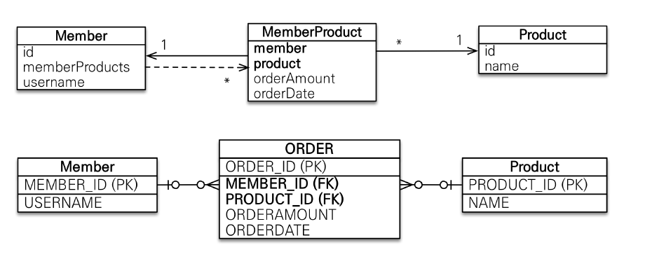

# 다양한 연관관계 매핑

## 다대일 (N:1)



다대일 관계는 가장 많이 사용되는 매핑이다. 외래키를 가지고 있는 테이블을 연관관계의 주인으로 매핑한다. 위의 예시를 살펴보면, `MEMBER`라는 테이블이 `TEAM_ID` 라는 외래키를 가지고 있다. 따라서 `Member`라는 객체의 참조 객체인 `Team`을 조작하면 `MEMBER`라는 테이블에 쿼리가 발생하는 매우 일반적인 상황이다.

만약 `Team`객체에서도 `Member`를 참조하고 싶은 경우 Chapter.5에서 살펴봤듯, 양방향 관계로 구현한다. 양방향 관계는 `@OneToMany`와 `mapped`라는 키워드를 사용했던 점을 기억하자.

**예시 코드**

```java
@SequenceGenerator(
name = "MEMBER_SEQ_GENERATOR",
sequenceName = "MEMBER_SEQ",            //매핑할 데이터베이스 시퀀스 이름
initialValue = 1, allocationSize = 50)
public class Member {
    @Id
    @GeneratedValue(strategy = GenerationType.SEQUENCE, generator = "MEMBER_SEQ_GENERATOR")
    @Column(name = "MEMBER_ID")
    private Long id;

    @Column(name = "USERNAME")
    private String username;

    @ManyToOne
    @JoinColumn(name = "TEAM_ID")
    private Team team;
}
```

```java
@SequenceGenerator(name ="TEAM_SEQ_GENERATOR", sequenceName = "TEAM_SEQ", initialValue = 1, allocationSize = 50 )
public class Team {

	@Id @GeneratedValue(strategy = GenerationType.SEQUENCE, generator = "TEAM_SEQ_GENERATOR")
	@Column(name = "TEAM_ID")
	private Long id;

	private String name;

    /*양방향 시 추가.
	@OneToMany(mappedBy = "team")		//매핑되는 컬럼 작성.(가짜매핑)
	private List<Member> members = new ArrayList<Member>();
    */
}
```

<br><hr>

## 일대다 관계 (1:N)



일대다 관계는 다대일 관계로 나타낼 수 있다. 이번에 살펴볼 내용은 연관관계의 주인을 `다` 쪽에 두는 것이 아니고, `일` 쪽에 두는 방식이다. **물론 이 방식은 단점이 많으며 권장되지는 읺는다.** 하지만 어떻게 사용하는지 정도는 알아두는 것이 좋다.

### 단점

- 그림에서 보는 것처럼 `Team`이 연관관계의 주인이므로 `Team` 객체에 있는 `members`를 조작하면 `MEMBER` 테이블에 쿼리가 발생한다. `Team` 객체를 조작했는데 `MEMBER`에 쿼리가 나가는 방식이므로 디버깅에 좋지 못하다는 단점이 있다.

- 두번째 단점으로는 SQL Update 쿼리가 한번 더 발생한다는 것이다. 다음의 예시를 한 번 보자.

```java

Member member = new Member();
member.setUsername("MEMBER1");
em.persist(member);             //Member insert 쓰기 지연 저장소에 쿼리 저장.

Team team = new Team();
team.setName("TEAM1");
team.getMembers().add(member);

em.persist(team);               // Team insert 쓰기 지연 저장소에 쿼리 저장.
                                // Member update 쓰기 지연 저장소에 쿼리 저장.

transaction.commit();
```

객체를 두 개 생성하고 각각의 객체를 영속성으로 관리한 후 커밋하면 `다대일` 관계에서는 2개의 Insert 쿼리가 발생한다. 하지만, 이 경우에는 Team 내에 members를 조작하면 `MEMBER` 테이블에 쿼리가 발생해야 하므로 1개의 Update 쿼리가 더 발생한다.

**예시 코드**

```java
@SequenceGenerator(
name = "MEMBER_SEQ_GENERATOR",
sequenceName = "MEMBER_SEQ",            //매핑할 데이터베이스 시퀀스 이름
initialValue = 1, allocationSize = 50)
public class Member {
    @Id
    @GeneratedValue(strategy = GenerationType.SEQUENCE, generator = "MEMBER_SEQ_GENERATOR")
    @Column(name = "MEMBER_ID")
    private Long id;

    @Column(name = "USERNAME")
    private String username;
}
```

```java
@SequenceGenerator(name ="TEAM_SEQ_GENERATOR", sequenceName = "TEAM_SEQ", initialValue = 1, allocationSize = 50 )
public class Team {

	@Id @GeneratedValue(strategy = GenerationType.SEQUENCE, generator = "TEAM_SEQ_GENERATOR")
	@Column(name = "TEAM_ID")
	private Long id;

	private String name;

	@OneToMany
    @JoinColumn(name= "TEAM_ID")
	private List<Member> members = new ArrayList<Member>();
}
```

반드시 `@JoinColumn`을 사용해야 한다. 이 애노테이션을 사용하지 않으면 default로 `@JoinTable`로 동작하여 중간 테이블이 하나 더 생성된다.

아니, 차라리 다대일 관계를 사용하자.

<br><hr>

## 일대일(1:1)



일대일 관계는 다대일 관계에서 외래키에 유니크 제약조건이 추가된 것이 전부이다. 따라서 일대일 관계에서는 양쪽 테이블 모두 외래키를 가질 수 있다. 개발자는 Entity를 설계할 때, 외래키를 가진 쪽을 연관관계 주인이 되도록 설정해주기만 하면 된다.

**예시 코드**

```java
@Entity
public class Member{
    @Id @GeneratedValue
    @Column(name="MEMBER_ID")
    private Long id;

    @Column(name = "USER_NAME")
    private String username;

    @OneToOne
    @JoinColumn(name = "LOCKER_ID")
    private Locker locker;
}
```

```java
@Entity
public class Locker{
    @Id @GeneratedValue
    private Long id;

    private String name;

    /* 양방향으로 설계할 때
    @OneToOne(mappedBy = locker)
    private Member member;
    */
}
```

### 외래키를 어디에 설정할까?

위 상황에서 외래키를 `MEMBER`에 두는게 옳을까? `LOCKER`에 두는게 옳을까?

정답은 없지만 자세히 한번 짚고 넘어가보자.

#### MEMBER (주 테이블)

먼저 `MEMBER`에 외래키를 뒀을 때를 생각해보자. 이 경우에는 주 객체가 대상 객체를 참조하도록 설계되었다는 점에서 `객체지향적`이고 JPA 매핑에도 편리하다. 개발자 입장에서 선호하는 방식이라고도 할 수 있다.

- 장점 : 주 테이블만 조회해도 `Locker` 값이 존재하는지를 확인할 수 있다.
- 단점 : 외래키의 값에 `Null`을 허용해주어야 한다.

#### LOCKER (대상 테이블)

이번에는 주 테이블이 아닌 `LOCKER`에 외래키가 있다고 생각해보자. 이 방식은 전통적인 데이터베이스 개발자가 선호하는 방식이다.

- 장점 : MEMBER가 여러 개의 LOCKER를 가질 수 있게 관계를 변경해야 할 때, 테이블의 구조가 변하지 않는다.
- 단점 : **프록시 기능의 한계로 지연 로딩을 설정해도 항상 즉시 로딩된다.**

<br><hr>

## 다대다(N:M)



다대다는 `@ManyToMany`와 `@JoinTable`을 사용해서 구현할 수 있다. 그렇게 되면 Member 객체와 Product 객체 둘만 가지고도 N:M 관계를 나타낼 수 있다.

하지만, 실제 DB에서는 조인 테이블(`MEMBER_PRODUCT`)이 필요하게 되므로 객체와 DB 사이에 패러다임의 차이가 발생한다. 게다가 실제 운영을 위한 DB라면 `MEMBER_PRODUCT` 안에는 다양한 컬럼들이 존재하기 마련이다. 예를 들어, `주문시간`, `주문수량` 정도가 있을 수 있다.

만약 `@ManyToMnay`를 사용한 경우라면 `MemberProduct`라는 객체가 없으므로, 조인 테이블에 있는 `MEMBER_PRODUCT`의 `주문수량`, `주문시간`에 접근할 수 없다.

따라서 **다대다 관계는 다대일 + 일대다 관계 두 개로 풀어내는 것이 바람직하다.**

<br>



이렇게 중간 `Entity`인 `Order(MemberProduct)`를 두고 1:N, N:1 관계로 이어주는 것이 좋다.

**예시 코드**

```java
@Entity
public class Member{
    @Id @GeneratedValue
    private Long id;

    private String username;

    @OneToMany(mappedBy = member)
    private List<Order> orders = new ArrayList<>();
}

@Entity
public class Order{
    @Id @GeneratedValue
    private Long id;

    @ManyToOne
    @JoinColumn(name="MEMBER_ID")
    private Member member;

    @ManyToOne
    @JoinColumn(name="PRODUCT_ID")
    private Product product;

    private long amount;
    private LocalDateTime orderDateTime;
}

@Entity
public class Product{
    @Id @GeneratedValue
    private Long id;
    private String name;

    @OneToMany(mappedBy = "product")
    private List<Order> orders = new ArrayList<>();
}
```

`Order` 테이블은 `MEMBER_ID`와 `PRODUCT_ID`를 합쳐서 복합키로 사용할 수 있다. 하지만 이렇게 식별관계로 키를 구성하게 되는 경우, ORDER 테이블의 유연성이 낮아진다는 단점이 있다. 미래를 위해서라도 기본키는 별도의 `시퀀스`로 두는 것이 좋다.

<br><hr>
