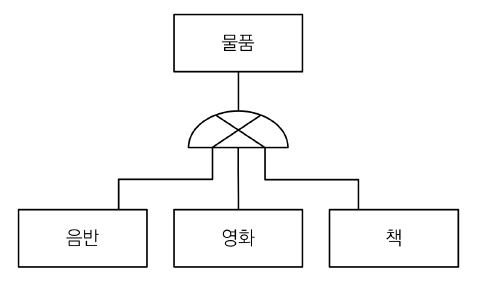
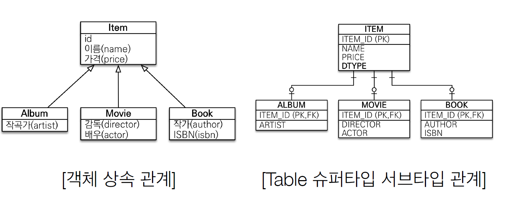
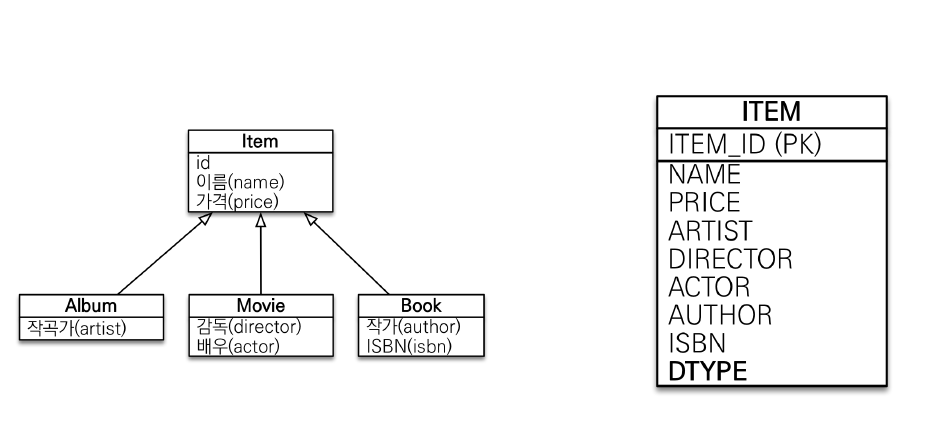
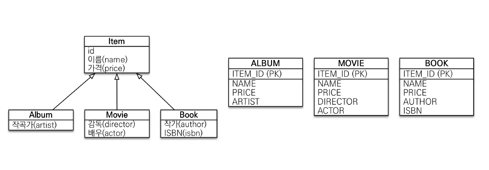
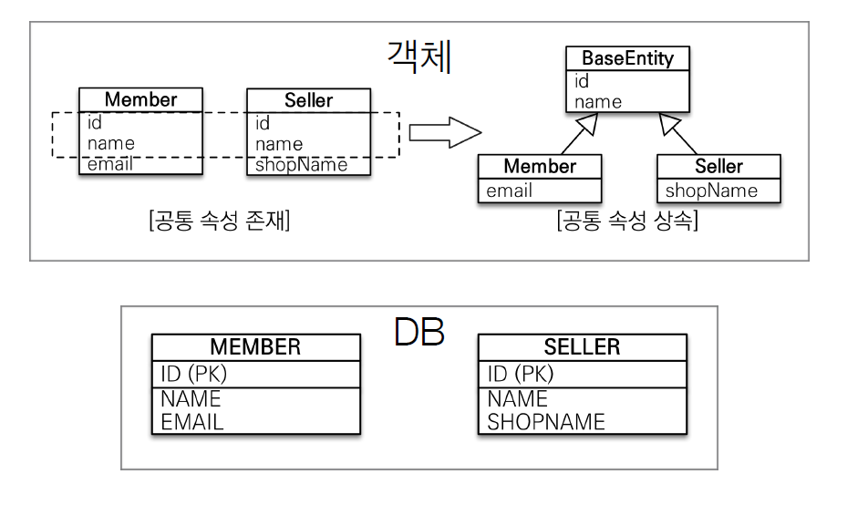

# 고급 매핑

## 상속관계 매핑

객체 지향 프로그래밍 언어에서는 상속은 중요한 요소 중 하나이다. 하지만, 관계형 데이터베이스에 상속이라는 개념은 존재하지 않는다. 따라서 `상속관계 매핑`은 `객체의 상속 구조`를 DB의 `슈퍼타입 서브타입 모델`과 매핑하는 작업이다. 그 둘 사이에서 발생할 수 있는 패러다임의 차이는 JPA가 해결해준다.

### 슈퍼타입 서브타입 모델



슈퍼타입 서브타입 모델을 DB에서 물리적으로 구현하는 방법은 총 3가지가 있다.

#### 조인 전략



`ITEM` 이라는 테이블을 두고 `ALBUM`, `MOVIE`, `BOOK`이 각각 `ITEM`을 참조하는 형태이다. 객체의 상속관계와 가장 유사한 형태이다.

`DTYPE`이라는 `구분` 컬럼이 없어도 상관없으나, ITEM에 대한 정산을 진행할 때 `DTYPE`이 없다면 굉장히 번거로울 수 있다. 가능하면 `DTYPE`을 추가해서 사용하자.

- 장점

  - 정규화된 테이블이기 때문에 중복된 데이터가 없다. 즉, 저장공간이 효율적이다.
  - 외래키 참조 무결성 제약조건 활용 가능 (주문 테이블에서 ITEM을 참조할 수 있다.)

- 단점
  - 조회 시 조인이 많이 발생한다.
  - **조회 쿼리가 복잡하다.**
  - 데이터 저장시 INSERT SQL 2번 호출된다.

_cf) 조회 쿼리가 복잡하다는게 최대 단점이고 나머지 단점은 크게 영향을 끼치지 않는다._

<br>

#### 단일 테이블 전략



단일 테이블 전략은 `Album`, `Movie`, `Book`을 하나의 테이블에 저장하는 전략이다. Alubm 데이터를 저장하는 경우, Director, actor, author, isbn 컬럼 값은 null이어야 하며, `DTYPE`은 `Alubm`으로 지정해야 한다.

`DTYPE`이라는 `구분` 컬럼이 없다면, 해당 레코드가 어떤 타입인지 알 수가 없다. 따라서 해당 컬럼은 JPA에 의해 강제된다.

- 장점

  - 조인이 필요없으므로 일반적으로 조회 성능이 좋다.
  - 조회 쿼리가 단순하다.

- 단점
  - **자식 엔티티가 매핑한 컬럼은 전부 null을 허용해야 한다.**
  - 단일 테이블에 모든 것을 저장하다보니 테이블이 비대해질 수 있다. 데이터의 임계치를 넘어서면 조회 성능이 더 느려질 수도 있다. (임계치는 대부분 넘지 않는다.)

_cf) 자식 엔티티에 전부 null을 허용해야 한다는 것이 최대 단점이다._

#### 클래스 : 테이블 전략



이 전략은 클래스 1개당 테이블 1개를 생성하는 전략이다.

- 장점

  - 서브 타입을 명확하게 구분해서 처리해야할 때 효과적이다.
  - not null 제약조건을 사용할 수 있다.

- 단점
  - **여러 자식 테이블과 함께 조회해야 하는 경우 성능이 느리다.** (UNION SQL 필요)
  - 자식 테이블을 통합해서 쿼리하기 어려움.

_cf) 상속관계를 구현할 때 가장 선호되지 않는 전략으로, 사용하지 않는 편이 좋다._

## 상속관계 매핑 구현

**예시 코드**

```java
@Entity
@Inheritance(strategy = InheritanceType.JOINED)
@DiscriminatorColumn
@Getter
@Setter
public class Item {

	@Id @GeneratedValue
	private Long id;
	private int price;
	private String name;
}

@Entity
public class Album extends Item{
	private String artist;
}

@Entity
public class Movie extends Item{
	private String director;
	private String actor;
}

@Entity
public class Book extends Item{
	private String isbn;
	private String author;
}
```

- 객체의 상속을 그대로 적용하고, `@Inheritence`를 이용해서 전략을 선택할 수 있다.

- `@DiscriminationColumn`은 `DTYPE`이라는 컬럼을 사용할지 말지를 결정한다. `DTYPE`이라는 이름 대신 다른 이름을 사용하도록 지정할 수는 있으나, 그냥 두는 것이 관례상 좋다.

- `DTYPE`에는 `Alubm`, `Movie`, `Book`과 같이 엔티티의 이름이 삽입되는데, 이 값을 변경하고 싶으면 각 클래스에서 `@DiscriminationValue('값')`을 사용해서 변경할 수 있다.

<hr><br>

## @MappedSuperClass



`@MappedSuperClass`는 객체의 공통된 부분을 추출해서 상속하는 것을 말하는데, DB 테이블은 단순히 공통된 부분이 추가된 형태로 생성된다. 즉, `@MappedSuperClass` 애노테이션이 붙어있는 클래스는 상속받는 자식 클래스에게 매핑 정보만을 제공하고 조회, 검색과 같은 작업은 불가능하다.

**예시 코드**

```java

@MappedSuperclass
@Getter
@Setter
public abstract class BaseEntity {

	private Long createdBy;
	private LocalDateTime createdDate;
	private Long lastModifiedBy;
	private LocalDateTime lastModifiedDate;
}

@Entity
public class Member extends BaseEntity{}
```

- `BaseEntity`는 엔티티가 아니므로 abstract로 등록해두는 것이 좋다.
