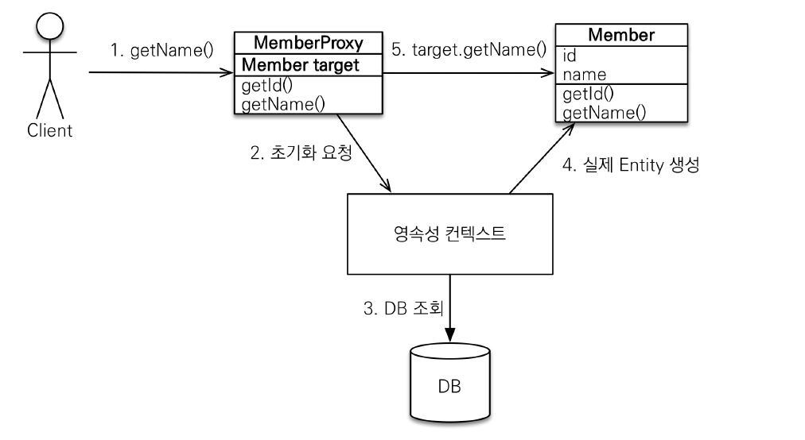
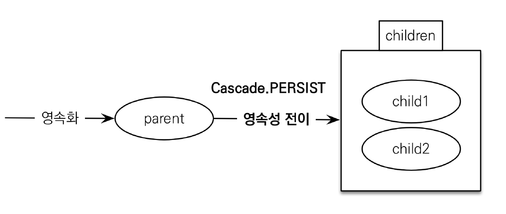

# 프록시와 연관관계 관리

## 프록시

프록시란, `대리자` 라는 뜻으로 A와 B사이에 두어 역할을 대신 해준다는 개념이다. `프록시 서버`는 클라이언트의 요청을 받아, 실제 서버에 요청을 전달하거나 캐시를 이용하여 직접 클라이언트에게 응답을 해주기도 한다.

이러한 `프록시`의 개념은 객체에서도 활용될 수 있다. `클라이언트`가 `객체 A`를 사용하고자 한다. 하지만 실제로 사용하게 되는 객체는 `객체 A`를 상속한 `Proxy A`로 대체할 수 있다. 이것을 `프록시 패턴` 이라고 부르며, `AOP`에서도 활용되고 있다. 이제는 JPA에서 사용되는 프록시에 대해 알아보자.

### 프록시 객체

우리는 DB에 있는 객체를 조회할 때 `em.find(Member.class, memberId)`와 같은 코드를 작성했다. 하지만 JPA에서는 `find()` 메서드 외에 `getReference()` 라는 메서드가 존재한다. 메서드의 사용법은 `find()`와 동일하지만 반환되는 객체는 `Member`가 아닌 `Proxy` 객체다.

**예시**

```java
Member member = em.getReference(Member.class, "id1");
member.getName();
```



`Member member = em.getReference(Member.class, "id1");`가 실행되었을 때, member에는 Proxy 객체가 할당된다. 이 `Proxy`라는 객체의 target이 가리키는 값은 null이다. 프록시 객체를 생성할 때 넘겨준 "id1"을 조회하는 경우를 제외하고, 그 외의 정보를 조회하는 경우에는 `초기화`라는 작업이 일어난다.

초기화란, `Proxy` 객체가 가리키는 target을 생성하는 과정으로 `영속성 컨텍스트`를 거쳐 DB에 조회한다. 조회된 정보를 바탕으로 Entity를 생성하고 그 객체를 `Proxy`의 target으로 지정한다.

**여기서 가장 중요한 점은, 영속성 컨텍스트를 통해서 Entity를 생성한다는 점이다!**

### 프록시 객체의 특징

#### 프록시 객체는 처음 사용할 때 한 번만 초기화된다.

**예제 코드**

```java
Member member = em.getReference(Member.class, "id1");
member.getName();       //Select 쿼리 발생.
member.getName();       //Select 쿼리 발생하지 않음.
```

<br>

#### 프록시 객체를 초기화 할 때, 프록시 객체가 실제 엔티티로 바뀌는 것이 아니라, 프록시 객체를 통해 실제 엔티티에 접근하는 것이다.

**예제 코드**

```java
Member member = em.getReference(Member.class, "id1");
System.out.println(member.getClass());  //Proxy
member.getName();                       //초기화
System.out.println(member.getClass());  //Proxy
```

<br>

#### 프록시 객체는 원본 엔티티를 상속받아 구현되었으므로 타입 비교 시에 `==`이 아니라 `instance of`를 사용해야 한다.

**예제 코드**

```java
public boolean typeCheck(Member member){
    return (member instanceof Member); // member가 Proxy인 경우에도 True를 반환한다.
}
```

<br>

#### 영속성 컨텍스트에 이미 찾는 엔티티가 있는 경우, `em.getReference()`를 호출해도 실제 엔티티를 반환한다.

**예제 코드**

```java
Member member = new Member();
member.setId("id1");
em.persist(member);         //1차 캐시에 저장.

Member refMember = em.getReference(Member.class, member.getId());
System.out.println("refMember class : " + refMember.getClass()); //Member 객체
System.out.println("member == refMember :" + (member == refMember)); //true
```

- JPA는 Collection에서 동일한 데이터를 꺼내왔을 때, ==으로 비교하면 true가 나오는 개념을 최대한 유지하고자 하는 것 같다!

<br>

#### 프록시 객체가 생성되었을 때, `em.find()`를 호출해도 프록시 객체가 반환된다.

**예제 코드**

```java
Member refMember = em.getReference(Member.class, "id1"); //Proxy
Member findMember = em.find(Member.class, "id1");     //Proxy
System.out.println("refMember == findMember :" + (refMember == findMember)); //true
```

- 한번 더 말하지만, JPA는 Collection에서 동일한 데이터를 꺼내왔을 때, ==으로 비교하면 true가 나오는 개념을 최대한 유지하고자 하는 것 같다!

<br>

#### 영속성 컨텍스트의 도움을 받을 수 없는 상태일 때, 프록시를 초기화하면 문제가 발생한다. (org.hibernate.LazyInitializationException 발생)

```java
Member refMember = em.getReference(Member.class, "id1"); //Proxy

em.close();                 //영속성 컨텍스트가 닫힘.
// em.detach(refMember);
// em.clear();

refMember.getName();        //예외 발생.
```

- 위에 언급된 3개 메서드가 호출되면, 영속성 컨텍스트의 도움을 받을 수 없기 때문에 예외가 발생한다.

### 프록시 확인

#### PersistenceUnitUtil.isLoaded(Object entity) : 초기화 확인

**예제 코드**

```java
Member member = em.getReference(Member.class, "id1");
System.out.println(emf.getPersistenceUnitUtil().isLoaded(member)); //False
```

<br>

#### org.hibernate.Hibernate.initialize(proxy) : 강제 초기화

**예제 코드**

```java
Member member = em.getReference(Member.class, "id1");
Hibernate.initialize(member);       //강제 초기화
```

<br><hr>

## 즉시로딩과 지연로딩

즉시로딩과 지연로딩을 다루기 전에, 이 두 방법이 왜 필요한지에 대해 생각해보자.

`Member` 엔티티 내에서 `Team` 엔티티를 참조하고 있다고 가정했을 때, `Member`를 조회하면 `Team`까지 한 번에 조회해야 할까?

애플리케이션에서 `Member`와 `Team`을 함께 사용하는 경우가 많다면 `Member`와 `Team`을 한 번에 조회하는 방법이 유리할 것이고, `Team`을 사용하는 경우가 거의 없다면 `Member`만 조회하는 것이 유리할 것이다. 따라서 JPA는 즉시로딩과 지연로딩을 지원한다.

**예제 코드**

```java
@ManyToOne(fetch = FetchType.EAGER) //즉시로딩
@JoinColumn(name = "TEAM_ID")
private Team team;

@ManyToOne(fetch = FetchType.LAZY)  //지연로딩
@JoinColumn(name = "TEAM_ID")
private Team team;
```

### 즉시로딩

즉시로딩을 사용하면 `Member` 엔티티가 참조하고 있는 엔티티 `Team`까지 한 번에 조회한다. JPA 구현체에 따라 동작방식에는 차이가 있을 수 있으나, 가능하면 `Member`와 `Team`을 조인해서 결과를 가져오는 SQL을 실행한다.

- 장점

  - 서로 관련이 있는 엔티티를 한 번에 조회할 수 있어 성능상 이점이 있다.

- 단점
  - **즉시 로딩으로 엮여있는 엔티티가 많을 경우 복잡한 조인 쿼리가 발생할 수 있다.**
  - **즉시 로딩은 JPQL에서 N+1 문제를 일으킨다.**

<br>

#### N+1 문제

```java
List<Member> members = em.createQuery("select m from Member m", Member.class)
                        .getResultList();
```

위와 같은 코드를 작성하면 `SELECT * FROM member` 라는 1번의 쿼리가 발생할 것이다. 하지만 `Member`에서 `Team`을 즉시로딩하고 있다면 각각의 멤버 객체에 `Team` 객체를 넣어줘야 한다. 따라서 `SELECT * FROM team where member_id = xxx` 라는 별도의 쿼리가 발생하게 된다. 문제는 이 쿼리가 조회된 member의 개수 N만큼 발생하기 때문에 N+1 문제라고 부른다. 이 문제는 추후에 FECTH JOIN을 이용해 해결하는 것이 일반적이다.

<br>

### 지연로딩

지연로딩은 `Member`라는 엔티티를 조회하면 `Member` 엔티티만을 조회하게 되고, `team`이라는 참조 변수는 `Proxy` 객체를 참조하게 된다. 따라서 `team` 내에 있는 어떤 정보를 참조할 때 비로소 `Select` 쿼리가 발생한다.

### 결론

즉시로딩은 실무에 적합하지 않으므로 가급적 지연로딩을 사용하자.

<hr><br>

## 영속성 전이 : CASCADE



영속성 전이란, 특정 엔티티를 영속 상태로 만들 때 연관된 엔티티도 함께 영속상태로 만드는 것을 의미한다. 특정 엔티티를 삭제할 때, 연관된 엔티티를 함께 삭제할 수도 있다.

영속성 전이는 연관관계 매핑과는 일절 관련이 없으며, 단순히 영속성에 대한 편리성을 제공할 뿐이다.

**예제 코드**

```java
@Entity
@Getter @Setter
public class Parent {
	@Id @GeneratedValue
	private Long id;
	private String name;

	@OneToMany(mappedBy = "parent", cascade = CascadeType.ALL)
	private List<Child> childList = new ArrayList<Child>();

	public void addChild(Child child) {
		childList.add(child);
		child.setParent(this);
	}
}
```

```java
Parent parent = new Parent();
Child child1 = new Child();
Child child2 = new Child();

parent.addChild(child1);
parent.addChild(child2);

em.persist(parent);         //Cascade로 child1, child2로 영속상태가 된다.
em.remove(parent);          //Cascade로 child1, child2도 DB에서 삭제된다.
```

- `ALL` 옵션을 사용하면 `PERSIST`와 `REMOVE`를 호출할 때 Cascade가 적용된다.
  DB에 삭제 쿼리가 나가는 것이 부담스러우면 `PERSIST` 옵션만 사용하는 것이 좋다.

- `Cascade`는 편리하지만 남용해서는 안된다. `Child`를 참조하는 엔티티가 `Parent` 하나일 때만 사용하는 것이 좋다. (ex. 게시글과 게시글에 포함된 첨부파일 관계)

<br><hr>

## 고아 객체

고아 객체란 부모 엔티티와 연관관계가 끊어진 자식 엔티티를 의미한다. `@OneToOne` 또는 `@OneToMany`에서 `orphanRemoval = true`로 설정해두면, 고아 객체가 자동으로 삭제 된다.

_cf) 참고 : 부모가 자식을 제거했을 때 자식은 고아 객체가 된다. 반대로 부모가 제거됐을 때, 모든 자식들은 고아 객체가 된다._

**예제 코드**

```java
@Entity
@Getter @Setter
public class Parent {
	@Id @GeneratedValue
	private Long id;
	private String name;

	@OneToMany(mappedBy = "parent", cascade = CascadeType.PERSIST, orphanRemoval = true)
	private List<Child> childList = new ArrayList<Child>();

	public void addChild(Child child) {
		childList.add(child);
		child.setParent(this);
	}
}
```

```java
Parent parent = new Parent();
Child child1 = new Child();
Child child2 = new Child();

parent.addChild(child1);
parent.addChild(child2);

em.persist(parent);

parent.getChildList().remove(0);        //delete 쿼리 발생.
em.remove(parent);                      //child 삭제에 대한 쿼리도 함께 발생.
```

- `orphanRemoval = true`으로 설정해두면, `cascade = CascadeType.REMOVE`로 설정해둔 것과 동일하게 부모가 삭제되면 자식도 함께 삭제된다.
- 특정 엔티티가 개인을 소유할 때만 사용한다. 다시 말해, 참조하는 곳이 하나일 때만 사용한다. (ex. 게시글과 게시글에 포함된 첨부파일 관계)

## CascadeType.ALL + orphanRemovel=true

이 두 옵션을 같이 사용하게 되면 `Child`에 대한 생명주기를 부모 엔티티 `Parent`에서 관리하게 된다. 즉, `DAO` 또는 `Repository`를 만들지 않아도 자식을 관리할 수 있다는 뜻이다. 이 두 옵션을 사용하면 DDD(도메인 주도 설계)의 `Aggregate Root` 개념을 구현할 때 유용하다.
