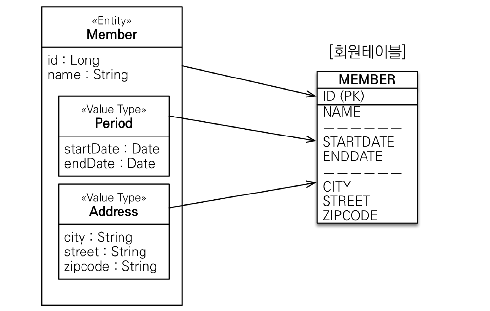
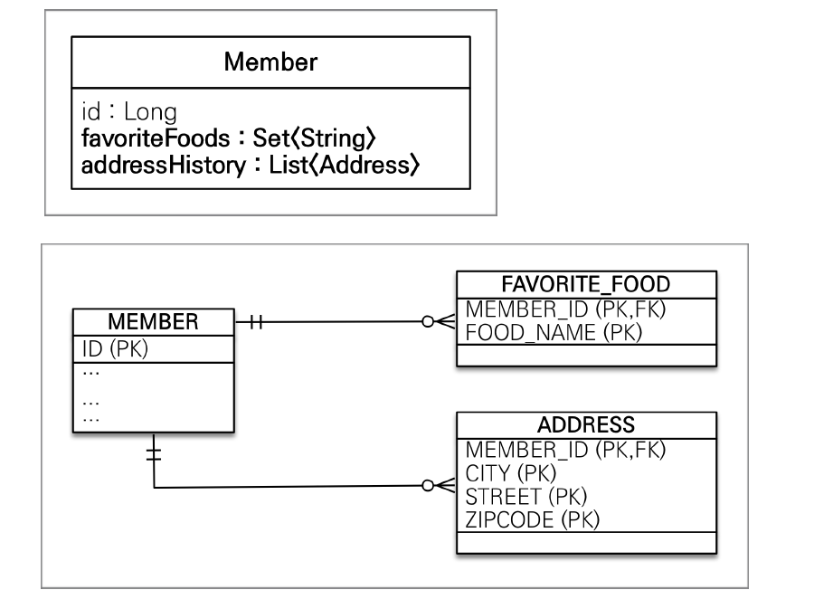

# 값 타입

## JPA의 데이터 타입 분류

### 엔티티 타입

`@Entity`로 정의되는 객체를 의미하며, 데이터가 변해도 식별자를 이용해서 지속적으로 추적이 가능하다. 예를 들면, 회원 엔티티에서 주소가 변경되어도 회원의 식별자만 있다면 그 회원을 검색할 수 있다.

### 값 타입

int, Integer, String처럼 단순히 값으로 사용하는 자바 기본타입의 객체를 의미한다. 식별자가 없고 값만 있으므로 변경 시 추적이 불가능하다. 엔티티의 필드로 정의되어있는 `String name`, `int age`과 같은 변수들이 대표적인 값 타입이다.

_ref) 자바의 기본 타입(primitive type)은 절대 공유되지 않는다. 기본 타입은 항상 값을 복사한다. Integer와 같은 래퍼 클래스나 String 같은 특수한 클래스는 공유 가능한 객체이지만 변경은 불가능하다._

## 임베디드 타입



- int, String과 같은 기본 값 타입을 모아서 객체로 정의한 것을 임베디드 타입이라고 하며, 이 객체를 엔티티 내부에서 사용할 수 있다.
- 그림에서 보는 것처럼 임베디드 타입은 엔티티의 값일 뿐이다.
- 임베디드 타입은 객체이므로 재사용이 가능하며, 관련된 메소드를 정의하여 사용할 수 있다는 장점이 있다.
- **임베디드 타입을 사용하기 전과 후에 매핑하는 테이블은 동일하다.**

**예시코드**

```java
@Embeddable
@Getter @Setter
public class Period{
    private LocalDateTime startDate;
    private LocalDateTime endDate;

    public Period(){}

    public Period(LocalDateTime startDate, LocalDateTime endDate){
        this.startDate = startDate;
        this.endDate = endDate;
    }
}

@Embeddable
@Getter @Setter
public class Address{
    private String city;
    private String street;
    private String zipcode;

    public Address(){}

    public Address(String city, String street, String zipcode){
        this.city = city;
        this.street = street;
        this.zipcode = zipcode;
    }
}

@Entity
@Getter @Setter
public class Member{
    @Id @GeneratedValue
    private Long id;
    private String name;

    @Embedded
    public Period wrokPeriod;

    @Embedded
    public Address homeAddress;
}
```

- `@Embeddable` : 값 타입을 정의하는 곳에 표시
- `@Embedded` : 값 타입을 사용하는 곳에 표시
- 기본 생성자는 필수로 정의해야 한다.

_cf) 한 엔티티에서 같은 값 타입을 여러 개 사용한다면 테이블에서 컬럼명이 중복된다. 이런 경우에는 `@AttributeOverrides` 또는 `@AttributeOverride`를 사용하여 컬럼명을 직접 명시한다._

**예시 코드**

```java
@Embedded
@AttributeOverrides
({
    @AttributeOverride(name="city", column=@Column("WORK_CITY")),
    @AttributeOverride(name="street", column=@Column("WORK_STREET")),
    @AttributeOverride(name="zipcode", column=@Column("WORK_ZIPCODE")),
})
private Address workAddress;

```

### 값 타입과 불변객체

임베디드 타입과 같은 값 객체는 여러 엔티티에서 공유하면 위험하다. 회원1과 회원2가 같은 주소를 사용한다고 해서 같은 객체를 참조한다면 문제가 발생할 수 있다. 예를 들어, 회원1의 주소가 변경되었을 때, 회원2의 주소가 같이 변경되는 전혀 예기치 못한 버그가 발생할 수도 있다.

부작용을 원천 차단하기 위해 값 타입 객체는 `불변 객체(Immutable Object)`로 설계하는 것이 좋다. 불변 객체는 생성한 시점 이후부터는 절대 변경할 수 없는 객체를 의미한다. 불변 객체를 만드는 가장 쉬운 방법은 `Setter`를 생성하지 않는 것이다.

_cf) Integer, String은 자바가 제공하는 대표적인 불변 객체이다._

### 값 타입의 비교

값 타입은 인스턴스가 달라도 그 안에 값이 같으면 같은 것으로 봐야 한다. 따라서 `equals` 메소드를 재정의하여 동등성 비교를 하는 것이 좋다.

<br><hr>

## 값 타입 컬렉션



값 타입을 하나 이상 저장할 때 사용할 수 있다. 값 타입 컬렉션을 사용하려면 `@ElementColleciton`, `@CollectionTable`을 사용하면 된다. 하지만 값타입 컬렉션은 치명적인 단점이 있기 때문에 가급적 사용하지 않는 것이 좋다.

**단점**

- 엔티티와 다르게 식별자가 없기 때문에 값이 변경되면 추적하기가 어렵다.
- 값 타입 컬렉션에 변경사항이 발생하면, 주인 엔티티와 연관된 모든 데이터를 삭제하고 값 타입 컬렉션에 있는 현재 값을 모두 다시 저장한다.
- 값 타입 컬렉션을 매핑하는 테이블은 모든 컬럼을 묶어서 기본 키를 구성해야 한다. 따라서 null 입력이 불가능하고, 중복 저장을 할 수 없다.

## 값 타입 컬렉션에 대한 대안

값 타입 컬렉션을 사용하기보다는 가급적 `엔티티`를 생성하고 `일대다` `다대다 양방향` 관계로 구현하는 것이 좋다. 값 타입 처럼 생명주기를 엔티티에 의존하고 싶다면 영속성 전이(CASCADE)와 고아 객체 제거 기능을 사용하면 된다.

**예시 코드**

```java
@Embeddable
@Getter @Setter
public class Address{
    private String city;
    private String street;
    private String zipcode;

    public Address(){}

    public Address(String city, String street, String zipcode){
        this.city = city;
        this.street = street;
        this.zipcode = zipcode;
    }
}

@Entity
public class AddressEntity extends Address{
    @Id @GeneratedValue
    private Long id;
    private Address address;
}

@Entity
@Getter @Setter
public class Member{
    @Id @GeneratedValue
    private Long id;
    private String name;

    @Embedded
    public Period wrokPeriod;

    @Embedded
    public AddressEntity homeAddress;

    //일대다 단방향 구현.
    @OneToMany(cascade = CascadeType.ALL, orphanRemoval = true)
    @JoinColumn(name="MEMBER_ID")
    public List<AddressEntity> addressHistory = new ArrayList<>();
}
```

**값 타입 컬렉션은 아주 단순한 데이터를 저장할 때에만 사용하자!**
