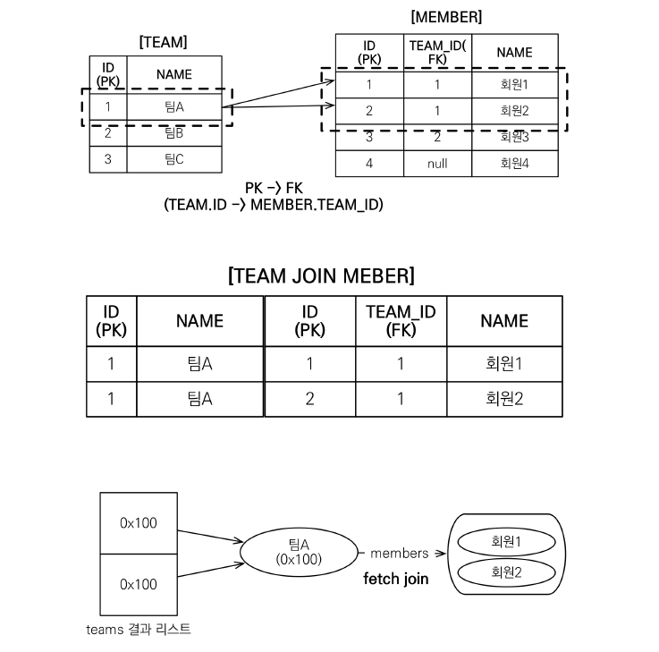
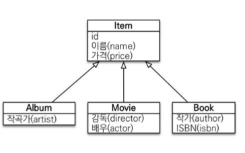

## JPQL 경로 표현식

경로 표현식이란 `.(점)`을 찍어 객체 그래프를 탐색하는 것을 의미한다.

- 상태 필드 : 단순한 값을 저장하기 위한 필드 ex) m.username, m.age
- 연관 필드 : 연관 관계를 위한 필드
  - 단일 값 연관 필드 : `@ManyToOne` `@OneToOne` ex) m.team
  - 컬렉션 값 연관 필드 : `@OneToMany` `@ManyToMany` ex) t.members

**예시코드**

```java
//상태 필드 출력
String query = "select m.username, m.age from Member m";

//단일 값 연관 필드의 객체 그래프 탐색
String query = "select o.member.team from Order o";

//컬렉션 값 연관 필드
String query = "select t.members from Team t";

//명시적 조인을 이용한 객체 그래프 탐색
String query = "select m.username from Team t join t.members m"; 
```

### 경로 표현식 특징

- **연관 필드는 묵시적 내부 조인이 발생한다.**

- 컬렉션 값 연관 필드는 추가적인 객체 그래프 탐색이 불가능하다는 특징이 있다. 

### 핵심

`묵시적 내부 조인`은 어떤 SQL이 발생하는지 예측하기가 어렵다. 따라서 `명시적 조인`을 사용하는 것이 좋다. `명시적 조인`은 내부 외부 조인을 자유롭게 사용할 수 있으며, SQL 결과를 예측할 수 있어, SQL 튜닝을 적용할 때 더 바람직하다.

<br>

## Fetch Join

페치 조인은 엔티티를 조회할 때 연관된 엔티티까지 한 번에 조회하는 기능이다. 즉, 즉시 로딩을 의미한다. 앞서 실무에서는 `@ManyToOne` 같은 애노테이션에 `Lazy` 전략을 사용하는 것이 좋다고 말했다. 하지만 실무에서 `쿼리 한 번`으로 연관된 데이터를 다 가져오는 방식은 반드시 필요하다.

**다대일, 일대일**

```java
//[JPQL]
String query = "select m from Member m join fetch m.team";

//[SQL]
SELECT M.*, T.*
FROM MEMBER M
INNER JOIN TEAM T
ON M.TEAM_ID = TEAM.ID;
```

**일대다**

```java
//[JPQL]
String query = "select t from Team t join fetch t.mebers";

//[SQL]
SELECT T.*, M.*
FROM TEAM T
INNER JOIN MEMBER M
ON T.ID = M.TEAM_ID;
```

- 일대다의 관계에서는 동일한 엔티티가 여러 개 조회될 수 있다.

- 동일한 엔티티 `Team`을 여러 개 반환받는 것이 싫다면 `DISTINCT` 키워드를 사용 하면 된다. JPQL의 `DISTINCT`는 SQL문에 `DISTINCT`를 추가해주는 기능 외에도 애플리케이션에서 중복되는 엔티티를 제거해주는 기능이 있다.

### 페치 조인과 일반 조인의 차이

- 일반 조인 실행 시 연관된 엔티티를 함께 조회하지 않는다. 따라서 연관된 엔티티를 조회하는 경우 N+1 문제가 발생한다.

<br><hr>

## 페치조인의 한계

### 페치 조인 대상에는 별칭을 사용할 수 없다. 

하이버네이트에서는 가능하지만 가급적 사용하지 말자. JPA의 페치조인은 연관된 엔티티를 모두 조회하는 것이 기본 컨셉이다.

**해서는 안될 행동**

```java
String query = "select t from Team t join fetch t.members m where m.age > 10";
```

- Team과 Member를 Fetch Join할 때 Fetch 대상에 별칭을 주는 행동은 JPA의 컨셉에 어긋난다.


### 둘 이상의 컬렉션은 페치 조인할 수 없다.

Team 엔티티가 Member와 1:N 관계이고 Team 엔티티가 Order와도 1:N 관계라고 해보자. 그러면 1:N:N 이므로 데이터의 개수가 기하급수적으로 증가할 수 있다. 따라서 이런 경우에는 페치 조인을 사용하면 안된다.

### 컬렉션을 페치 조인하면 페이징 API를 사용할 수 없다.

일대일, 다대일 같은 단일 값 연관 필드는 페치 조인해도 페이징이 가능하다.

하지만, 컬렉션을 페치 조인하는 경우에는 페이징 API를 사용할 수 없다. 그 상황을 가장 잘 나타내는 그림을 하나 살펴보자.



Team과 Member의 조인 결과를 보면, 팀A에 속한 멤버가 두 명이므로 데이터가 두 개 조회된 것을 볼 수 있다. 만약 페이징으로 1개의 데이터만 가져오면 어떻게 될까? 팀A에 속한 회원이 1명이라고 오해하기 딱 좋다. 따라서 절대! 컬렉션을 페치 조인했을 때는 페이징 API를 사용하면 안된다.

_cf) 하이버네이트에서는 경고 로그를 남기고 메모리에서 페이징할 수 있다. 이 경우에는 모든 데이터를 메모리에 올리고 페이징하기 때문에 아주 아주 위험한 행동이다._

**해결 방법**

1. 일대다 관계 대신 `다대일 관계`로 데이터를 가져온다.

```java
String query = "select m from Member m join fetch m.team";
```

2. BatchSize를 활용하여, 한 번에 많은 데이터를 읽어들인다.

```java
//[엔티티]
@Entity
public class Team{
  @Id @GeneratedValue
  private Long id;

  private String name;

  //배치 사이즈를 1000보다 작은 수 중 적당한 수로 채택.
  @BatchSize(size = 100)
  @OneToMany(mappedBy = "team")
  private List<Member> members = new ArrayList<>();
}
```

```java
//[비즈니스 로직]

//팀 전체 중, 10개만 페이징해서 가져온다.
String query = "select t from Team t";
List<Team> list = em.createQuery(query, Team.class)
                    .getFirstResult(0)
                    .getMaxResults(10)
                    .getResultList();

//현재 members는 Lazy Loading된 상태라고 볼 수 있다. 이 상태에서 members의 필드에 접근하면 SQL문이 발생한다.
for(Team team : list){
  for(Member member : team.getMembers()){
    System.out.println(member.getName());
  }
}
```

- `@BatchSize`를 지정해주지 않았을 때는 N+1 문제가 발생한다.

- `@BatchSize(100)`으로 지정했을 때에는 Team과 연관된 Member를 조회할 때 하나씩 조회하는 것이 아니라 BatchSize의 개수만큼 한 번에 조회한다.

- Team 엔티티 10개를 페이징해서 가져왔는데, `BatchSize`가 100이므로 한 번의 쿼리로 최대 100개의 팀에 소속된 멤버를 전부 다 가져올 수 있다.

- 발생하는 SQL문의 where절은 `where = m.TEAM_ID IN (?, ?, ? ... ?)` 로 나타나는 것을 볼 수 있다.

<br>

## 페치조인의 특징

- 연관된 엔티티들을 SQL 한 번으로 조회하기 때문에 성능 최적화에 좋다.

- 엔티티에 직접 적용하는 글로벌 로딩 전략보다 우선한다. 따라서 엔티티에 `@OneToMany(fetch=FetchType.LAZY)`라는 메타데이터가 작성되어있어도 무시된다.

- 실무에서 글로벌 로딩 전략은 모두 지연로딩으로 사용하고, 최적화가 필요한 곳에서 페치조인을 사용한다.

## 페치 조인 - 정리

- 모든 것을 페치 조인으로 해결할 수는 없다.

- 페치 조인은 객체 그래프를 탐색할 때 사용하면 효과적이다.

- 여러 테이블을 조인해서 엔티티가 가진 모양이 아닌 전혀 다른 결과를 내야 한다면, 페치 조인 보다는 일반 조인을 사용하고 필요한 데이터들만 조회해서 DTO로 반환하는 것이 효과적이다. (물론, 페치 조인을 사용하고 어플리케이션에서 원하는 DTO에 데이터를 바인딩할 수도 있다.)

<br><hr>

## 다형성 쿼리



객체의 상속 구조는 데이터베이스의 `슈퍼타입-서브타입` 관계로 나타낼 수 있다고 했다. 이렇게 객체의 상속 구조가 있을 때 조회 대상을 특정 자식으로 한정할 수가 있다.

**Type 키워드**

```java
// Item 중에서 Book과 Movie만 조회한다.
String query = "select i from Item i where type(i) in (Book, Movie)";

//발생하는 SQL
SELECT i
FROM ITEM i
WHERE i.DTYPE in ('Book', 'Movie');
```

<br>

**Treat 키워드**

```java
//작가의 이름이 kim인 Item을 조회한다.
String query = "select i from Item i where treat(i as Book).author = 'kim'";

//발생하는 SQL (Single Table 가정)
SELECT i.*
FROM Item i
WHERE i.DTYPE='Book'and i.author = 'kim';
```

<br><hr>

## JPQL -엔티티 직접 사용

JPQL에서 엔티티를 직접 사용하면 SQL에서 해당 엔티티의 기본 키 값을 사용한다.

**예시 코드**

```java
//m.id = :memberId 와 동일한 결과를 반환한다.
String query = "select m from Member m where m = :member";

//m.team.id = :teamId 와 동일한 결과를 반환한다.
String query = "select m from Member m where m.team = :team";
```

<br><hr>

## Named Query

`Named Query`는 정적 쿼리를 미리 정의해두고, 여러 군데서 사용할 수 있도록 하는 방법이다. `Named Query`는 애플리케이션 로딩 시점에 초기화하고 JPQL을 SQL로 파싱 해두기 때문에 JPQL을 SQL로 파싱하는 코스트를 줄일 수 있다. 무엇보다도 **애플리케이션 로딩 시점에 쿼리를 검증해주기 때문에 버그를 사전에 차단할 수 있다.**

애노테이션, XML 정의 두 가지 사용 방법이 있으나, 실무에서는 Spring data JPA의 `@Query` 애노테이션을 사용할 것이므로 간단한 예시 하나만 보고 넘어간다.

**사용 예시**

```java
@Entity
@NamedQuery{
    name = "Member.findByUsername",
    query = "select m from Member m where m.username = :username"
}
public class Member {
  ...
}

List<Member> result = em.createNamedQuery("Member.findByUsername", Member.class)
                            .setParameter("username", "회원1")
                            .getResultList();
```

<br><hr>

## 벌크연산

벌크연산이란, 한 번에 많은 양의 데이터를 `INSERT`, `UPDATE`, `DELETE` 하는 것을 말한다. 

JPA 변경감지 기능으로 데이터를 변경하는 경우 너무 많은 SQL문이 발생할 수 있다. 예를 들어, 모든 사원의 연봉을 10% 인상해야 한다고 해보자. 이때, 모든 사원을 조회하고, 반복문을 이용해서 각 사원의 연봉을 10% 인상시키면 트랜잭션 커밋 시점에 데이터의 개수만큼 `UPDATE` 쿼리가 발생하게 된다.

**Update 예시**

```java
//재고가 N개 미만인 모든 상품의 가격을 10% 인상시킨다.
String query = "update Product p" +
               "set p.price = p.price * 1.1" +
               "where p.stock < :stockAmount";

//변경된 로우의 개수를 반환.
int updateCount = em.createQuery(query)
                    .setParameter("stockAmount", 10)
                    .executeUpdate();
```

<br>

### 벌크 연산 주의사항

벌크연산은 영속성 컨텍스트를 무시하고 데이터베이스에 직접 쿼리한다. 따라서 잘못 사용하면 데이터 정합성이 깨질 수 있다.

벌크 연산을 사용할 때 정합성을 보장받으려면 다음과 같은 방식을 사용하는 것이 좋다.

#### 방법1. 벌크 연산을 먼저 수행한다.

벌크 연산을 먼저 수행하면 영속성 컨텍스트는 비워져있기 때문에 데이터 정합성에 문제가 생길 여지가 없다.

#### 방법2. 벌크 연산 수행 후 영속성 컨텍스트를 초기화한다.

벌크 연산을 수행한 결과는 영속성 컨텍스트에 반영되지 않는다. 따라서 영속성 컨텍스트를 초기화한 뒤 데이터를 다시 조회해 사용하는 것이 안전하다.

**예시 코드**

```java

//쿼리 발생 시 FLUSH가 자동 호출된다. 따라서 FLUSH 후에, 벌크연산이 수행된다.
int resultCount = em.createQuery(updateQuery)
                    .executeUpdate();
//영속성 컨텍스트 초기화
em.clear();
```

